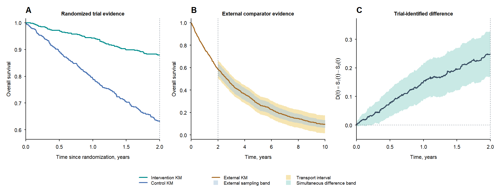

# WISESurv

`WISESurv` computes sharp assumption-indexed bounds for long-term survival
benefit, discounted survival utility, and robust net monetary benefit decisions.

## Installation

`WISESurv` requires R 4.1.0 or later. Install the development version from
GitHub with:

```r
install.packages("remotes")
remotes::install_github("haohaostats/WISESurv")
```

The package uses the HiGHS linear-programming solver. Its R dependency is
installed automatically from CRAN. If dependency installation has been
disabled, install the required packages first:

```r
install.packages(c("highs", "Matrix"))
remotes::install_github("haohaostats/WISESurv", dependencies = TRUE)
```

Verify the installation with:

```r
library(WISESurv)
packageVersion("WISESurv")
```

## Basic usage

```r
library(WISESurv)

# Reproducible example data included with the package
trial_data <- wise_example_trial()

spec <- wise_spec(
  effect_upper = 0.35,
  residual = c(0.50, 0.80),
  decline_rate = 0.005,
  rebound_rate = 0.045
)

fit <- wise_surv(
  trial = trial_data,
  cutoff = 2,
  horizon = 15,
  specification = spec
)

bounds <- wise_bounds(fit, "rmst", horizons = c(7, 10, 15))
bounds

outer <- wise_outer_bounds(
  fit,
  estimand = "rmst",
  horizons = c(7, 10, 15),
  level = 0.95,
  multipliers = 999
)

qaly <- wise_outer_bounds(
  fit,
  estimand = "qaly",
  utility = 0.75,
  discount_rate = log(1.035)
)

wise_nmb(qaly, cost = 20000,
         willingness_to_pay = c(20000, 30000, 50000))
```

The final call returns `robust adoption` at all three willingness-to-pay
thresholds in this reproducible example.

## Plotting

Create a publication-style overview of the trial, external evidence, and
simultaneous difference band:

```r
external_data <- subset(
  wise_example_trial(
    n_per_arm = 900,
    seed = 20260925,
    administrative_censoring = 10
  ),
  arm == 0,
  select = c(time, status)
)

external_source <- wise_external_ipd(
  external_data,
  arm = 0,
  tolerance = 0.08,
  active_range = c(2, 10),
  name = "External control"
)

evidence_fit <- wise_surv(
  trial = trial_data,
  cutoff = 2,
  horizon = 15,
  external = external_source,
  specification = spec
)

plot(evidence_fit)
```



The current development version implements structural trajectory classes,
sharp RMST and discounted-utility bounds, covariance-aware joint multiplier
input regions, sampling-error-protected outer bounds, external survival
intervals and individual-level external data, compatibility diagnosis, robust
fixed-cost NMB decisions, and publication-style evidence visualization.
